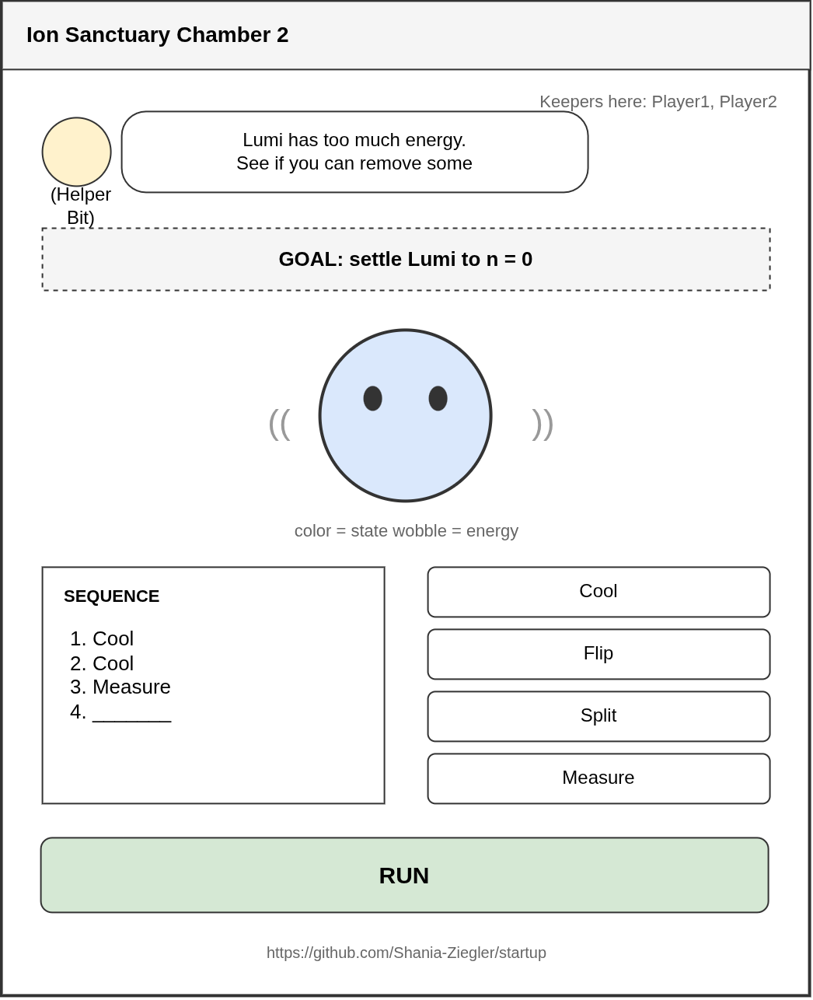
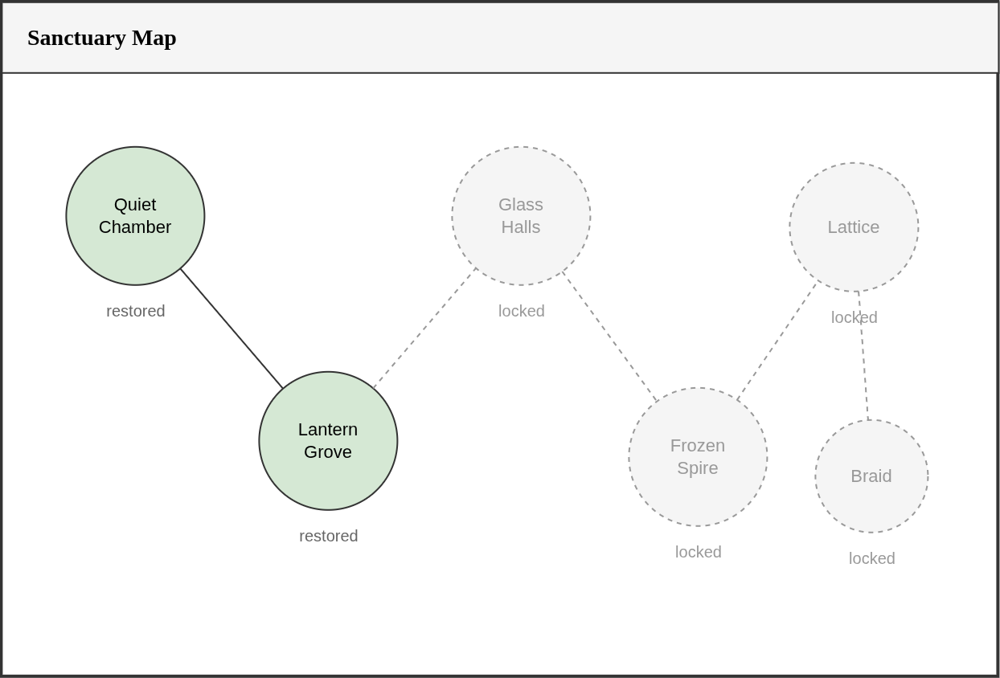
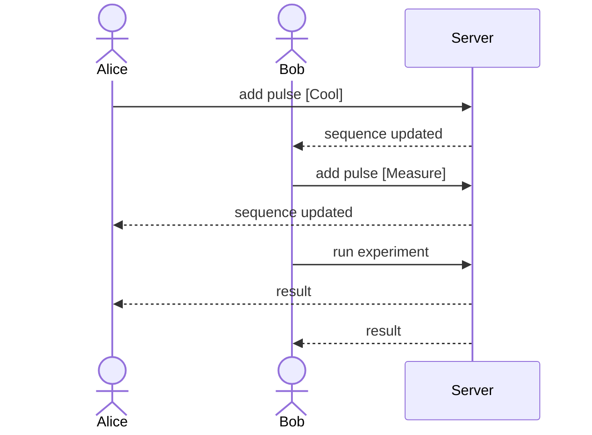

# Quantum Sanctuary 

[My Notes](notes.md)

### Elevator pitch
The hardware behind quantum computers can have a reputation for being challenging to understand, and most explanations open with equations that seem complex. Quantum Sanctuary takes a lighter approach: it gives you quantum particles to look after. You are an apprentice restoring a sanctuary of quantum spirits, each chamber home to a different one, and Lumi, a trapped ion, lives in the first. You cannot touch her or move her yourself; the only way to reach her is with light. Each chamber gives you a goal and a few kinds of pulses, and you put them in order, run the experiment, and read the result off Lumi herself. Her color shows her state and her wobble shows her energy. Two apprentices can share a chamber and run experiments together in real time. By the end you will understand some basic terminology, and you will have picked it up playing with friends. 

### Design

The chamber view at first chamber. 
Bit gives the goal at the top, Lumi sits in the middle
The pulses you can use along with the sequence you are building are below her.

The sanctuary map. Each chamber holds a different kind of quantum spirit, and they unlock as you restore the ones before them.

This sequence diagram shows two players sharing a chamber.

### Key features
- Secure login over HTTPS
- Ability to select a chamber from the sanctuary map
- Ability to add and remove pulses to build a sequence
- Ability to run the sequence and watch Lumi react
- Sequence changes from other apprentices displayed in realtime
- Progress and best scores are persistently stored

### Technologies

I am going to use the required technologies in the following ways.

- **HTML** - Uses HTML structure for the application. Four views: entrance, login, sanctuary map, and chamber. Hyperlink to my GitHub repository on the home page.
- **CSS** - Application styling that works across screen sizes. Lumi is animated with CSS keyframes so she floats and wobbles according to her current state.
- **React** - Single page application. Components for the pulse buttons, the sequence, Lumi, and the chamber view. React routing moves between the entrance, login, map, and chamber views based on what the user does.
- **Service** - Backend service with endpoints for:
  - register, login, and logout
  - retrieving a chamber's goal and available pulses
  - submitting a sequence and returning the result and score
  - saving and retrieving player progress
  - retrieving measurement randomness from [qrandom.io](https://qrandom.io/docs), falling back to a local random number generator if the service is rate limited or down
- **DB/Login** - Store users, progress, and best scores in MongoDB. Register and login users. Credentials securely stored in the database. Cannot play unless authenticated.
- **WebSocket** - The sequence is shared between players in a chamber. As each one adds or removes a pulse, the change is broadcast to the others, and running the experiment is broadcasted to the other players.

## 🚀 Specification Deliverable

> [!NOTE]
> Fill in this sections as the submission artifact for this deliverable. You can refer to this [example](https://github.com/webprogramming260/startup-example/blob/main/README.md) for inspiration.

For this deliverable I did the following. I checked the box `[x]` and added a description for things I completed.

- [x] I completed the prerequisites for this deliverable (Git commit requirement)
- [x] Proper use of Markdown
- [x] A concise and compelling elevator pitch
- [x] Description of key features
- [x] Description of how you will use each technology including your 3rd party API and use of WebSocket
- [x] One or more rough sketches of your application. Images must be embedded in this file using Markdown image references.

## 🚀 AWS deliverable

For this deliverable I did the following. I checked the box `[x]` and added a description for things I completed.

- [x] **Rented EC2 server** 
- [x] **Leased domain name** 
- [x] **Server accessible** from my domain: [https://quantumsanctuary.click](https://quantumsanctuary.click) - Working over HTTPS with a certificate issued by Caddy.

## 🚀 HTML deliverable

For this deliverable I did the following. I checked the box `[x]` and added a description for things I completed.

- [ ] I completed the prerequisites for this deliverable (Simon deployed, GitHub link, Git commits)
- [ ] **HTML pages** - I did not complete this part of the deliverable.
- [ ] **Proper HTML element usage** - I did not complete this part of the deliverable.
- [ ] **Links** - I did not complete this part of the deliverable.
- [ ] **Text** - I did not complete this part of the deliverable.
- [ ] **3rd party API placeholder** - I did not complete this part of the deliverable.
- [ ] **Images** - I did not complete this part of the deliverable.
- [ ] **Login placeholder** - I did not complete this part of the deliverable.
- [ ] **DB data placeholder** - I did not complete this part of the deliverable.
- [ ] **WebSocket placeholder** - I did not complete this part of the deliverable.

## 🚀 CSS deliverable

For this deliverable I did the following. I checked the box `[x]` and added a description for things I completed.

- [ ] I completed the prerequisites for this deliverable (Simon deployed, GitHub link, Git commits)
- [ ] **Visually appealing colors and layout. No overflowing elements.** - I did not complete this part of the deliverable.
- [ ] **Use of a CSS framework** - I did not complete this part of the deliverable.
- [ ] **All visual elements styled using CSS** - I did not complete this part of the deliverable.
- [ ] **Responsive to window resizing using flexbox and/or grid display** - I did not complete this part of the deliverable.
- [ ] **Use of a imported font** - I did not complete this part of the deliverable.
- [ ] **Use of different types of selectors including element, class, ID, and pseudo selectors** - I did not complete this part of the deliverable.

## 🚀 React part 1: Routing deliverable

For this deliverable I did the following. I checked the box `[x]` and added a description for things I completed.

- [ ] I completed the prerequisites for this deliverable (Simon deployed, GitHub link, Git commits)
- [ ] **Bundled using Vite** - I did not complete this part of the deliverable.
- [ ] **Components** - I did not complete this part of the deliverable.
- [ ] **Router** - I did not complete this part of the deliverable.

## 🚀 React part 2: Reactivity deliverable

For this deliverable I did the following. I checked the box `[x]` and added a description for things I completed.

- [ ] I completed the prerequisites for this deliverable (Simon deployed, GitHub link, Git commits)
- [ ] **All functionality implemented or mocked out** - I did not complete this part of the deliverable.
- [ ] **Hooks** - I did not complete this part of the deliverable.

## 🚀 Service deliverable

For this deliverable I did the following. I checked the box `[x]` and added a description for things I completed.

- [ ] I completed the prerequisites for this deliverable (Simon deployed, GitHub link, Git commits)
- [ ] **Node.js/Express HTTP service** - I did not complete this part of the deliverable.
- [ ] **Static middleware for frontend** - I did not complete this part of the deliverable.
- [ ] **Calls to third party endpoints** - I did not complete this part of the deliverable.
- [ ] **Backend service endpoints** - I did not complete this part of the deliverable.
- [ ] **Frontend calls service endpoints** - I did not complete this part of the deliverable.
- [ ] **Supports registration, login, logout, and restricted endpoint** - I did not complete this part of the deliverable.
- [ ] **Uses BCrypt to hash passwords** - I did not complete this part of the deliverable.

## 🚀 DB deliverable

For this deliverable I did the following. I checked the box `[x]` and added a description for things I completed.

- [ ] I completed the prerequisites for this deliverable (Simon deployed, GitHub link, Git commits)
- [ ] **Stores data in MongoDB** - I did not complete this part of the deliverable.
- [ ] **Stores credentials in MongoDB** - I did not complete this part of the deliverable.

## 🚀 WebSocket deliverable

For this deliverable I did the following. I checked the box `[x]` and added a description for things I completed.

- [ ] I completed the prerequisites for this deliverable (Simon deployed, GitHub link, Git commits)
- [ ] **Backend listens for WebSocket connection** - I did not complete this part of the deliverable.
- [ ] **Frontend makes WebSocket connection** - I did not complete this part of the deliverable.
- [ ] **Data sent over WebSocket connection** - I did not complete this part of the deliverable.
- [ ] **WebSocket data displayed** - I did not complete this part of the deliverable.
- [ ] **Application is fully functional** - I did not complete this part of the deliverable.
